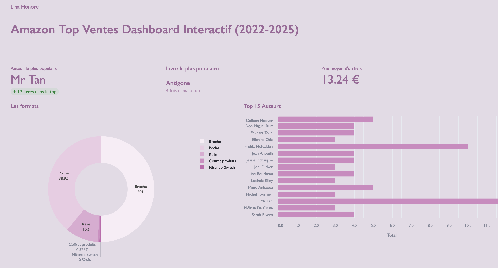

This project is an interactive dashboard designed to visualize Amazon best-selling books over four years, by author, title, format, and price.
It was created as a learning project to explore Python libraries such as Streamlit and Pandas.
The data used in this project comes from the Amazon France marketplace.


PREVIEW:





HOW TO RUN THIS DASHBOARD?

HOW TO RUN THIS DASHBOARD?

```bash
git clone https://github.com/hnrlina/amazon-dashboard.git
pip install -r requirements.txt
streamlit run streamlit_app.py
```


PYTHON LIBRARIES USED:
	- Streamlit
	- Pandas
	- Plotly Express
	- Plost


FEATURES
	- Filter by author, title, format, price, and year
	- Display the most popular author
	- Display the most popular book
	- Visualize book formats using a donut chart
	- View the top 15 authors with a bar chart
	- Calculate the average book price


AUTHOR / CONTACT

Author : Lina Honoré
LinkedIn : www.linkedin.com/in/lina-honoré-961589383

